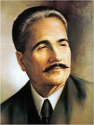
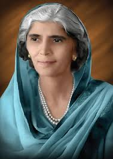
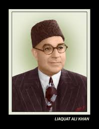

HOME
<!DOCTYPE html>
<html>
<head>
<h1>Inspirational Quotes From Our Great Heroes</h1>
<!--style goes here-->

</head>

<body>
<a> <href="index.html">my.web_page.txt</a>

<ul>
<li>Muhammad Ali Jinnah</li>
<li>Allama Iqbal</li>
<li>Fatima Jinnah</li>
<li>Liaqat Ali Khan</li>
</ul>

<h2>Muhammad Ali Jinnah</h2>

"Muhammad Ali Jinnah (1876-1948) was a prominent barrister, politician,
and the founder of Pakistan. He is widely revered as the "Father of the Nation" 
(Quaid-e-Azam) in Pakistan. Jinnah served as the first Governor-General of Pakistan
 after its independence in 1947."
 

<h3>Famous Sayings of Jinnah</h3>
<ul>
<li>
"There are two powers in the world; one is the <strong>SWORD</strong> and the other is
 the <strong>PEN</strong>.There is a great <em>competition</em> and <em>rivalry</em> between the two.
 There is a third power <strong>STRONGER</strong> than both, that of the <strong>WOMEN</strong>."
 </li>
<li>
"There is <strong>NO</strong> power on earth that can <strong>UNDO</strong> Pakistan."

</li> 
<li>
"<strong>CHARACTER</strong>, <strong>COURAGE</strong>, <strong>INDUSTRY</strong> and
<strong>PRESERVANCE</strong> are the four pillars on which the whole edifice of human
life can be built and <strong>FAILURE</strong> is a word <strong>UNKNOWN</strong>
to me."
</li> 
<li>
"I insist you to <strong>STRIVE</strong>. Work, Work and only work for <em>satisfaction</em>
 with <em>patience</em>, <em>humbleness</em> and <em>serve thy nation</em."
</li> 

</ul>

<h2>Allama Iqbal</h2>

"Allama Muhammad Iqbal, also known as Allama Iqbal, was a prominent 20th-century 
Muslim poet, philosopher, and politician from British India, widely regarded
as the "spiritual father of Pakistan". He is renowned for his Urdu and Persian poetry, 
which explored themes of Islamic philosophy, the need for social and cultural reform, 
and the concept of Khudi (self-hood).He is also credited with inspiring the Pakistan 
Movement and is the National Poet of Pakistan."

<h3>Famous Sayings of Iqbal</h3>

<ul>
<li>
"Be aware of your own <strong>WORTH</strong>, use all of your <strong>POWER</strong>
 to achieve it.Create an <em>ocean</em> from a <em>dewdrop.</em> Do not beg for light from the moon, 
obtain it from the spark within you."
</li> 
<li>
"If one cannot live the life of the brave, 
then it is better to <strong>DIE</strong> like the <strong>BRAVE</strong>."
</li> 
<li>
"Life is a struggle and not a matter of privilege. 
It is nothing but one's knowledge of the temporal and the spiritual world."

</li> 
<li>
"I tell you the sign of a <strong>BELIEVER</strong>; When <strong>DEATH</strong> comes, 
there is a <em>smile</em> on his lips."
</li> 

</ul>

<h2>Fatima Jinnah</h2>

"Fatima Jinnah (1893-1967) was a Pakistani dental surgeon, politician, 
and stateswoman. She was the younger sister of Muhammad Ali Jinnah, 
the founder of Pakistan, and played a significant role in the Pakistan Movement. 
She co-founded the All Pakistan Women's Association and was a vocal critic of the British Raj. 
In 1965, she ran for president against Ayub Khan and her campaign highlighted her commitment 
to civil rights and democratic values.
She was also called the Madr-e-Millat("Mother of the Nation")."
 

<h3>Famous Sayings of Fatima</h3>

<ul>
<li>
"No individual or people can achieve anything without 
industry <strong>SUFFERING</strong>, and <strong>SACRIFICE.</strong>"
</li> 
<li>
"There is a magic power in your own hands. Take your vital decisions-they may be grave 
and momentous and far-reaching in their consequences. <strong>THINK</strong> a hundred times before 
you take any <strong>DECISION</strong>, but once a decision is taken, stand by it as <strong>
ONE MAN.</strong>"
</li> 

<li>"The Constitution of Pakistan is neither presidentiary nor parliamentary; it is <strong>UNIQUE
</strong>."

</li> 

<li>"No nation can ever be worthy of it's existence that cannot take its <strong>WOMEN</strong> along with 
the men.No <strong>STRUGGLE</strong> can ever succeed <strong>WITHOUT</strong> women participating side by side
 with men."</li>
 
<li>
"The constitution is one of the first essentials on which our <strong>FUTURE</strong>
 and <strong>PROGRESS</strong> are based."</li>
 

</ul>

<h2>Liaqat Ali Khan</h2>

"Liaquat Ali Khan was Pakistan's first Prime Minister, serving from 1947 until 
his assassination in 1951. He played a crucial role in the Pakistan Movement 
and is revered as the "Quaid-e-Millat" (Leader of the Nation) and later as "Shaheed-e-Millat" 
(Martyr of the Nation). Khan was a close associate of Muhammad Ali Jinnah, the founder 
of Pakistan, and is considered one of the key figures in the nation's early years." 

<h3>Famous Sayings of Khan</h3>

<ul>

<li>
"We will <strong>NEVER</strong> allow our <strong>FREEDOM</strong> to be taken away.We shall <strong>FIGHT
</strong> Aggression wherever it may be."
</li> 
<li>
<em>"Gentlemen! Our Souls are not for Sale."</em>
</li> 
<li>
"The Prime Minister of a poor country cannot afford to have new clothes,lavish food and 
personal home for his self."
</li> 
<li>
"The story of Pakistan is the story of great <strong>IDEALS</strong>, of <strong>
STRUGGLE</strong> and <strong>SACRIFICE.</strong>"

</li> 

</ul>
</body>
</html>

